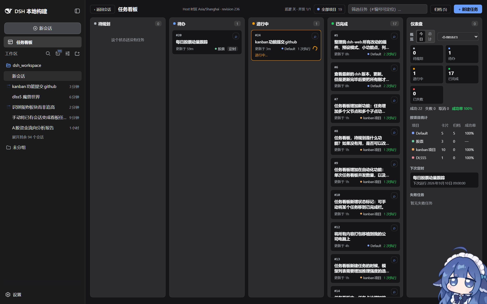
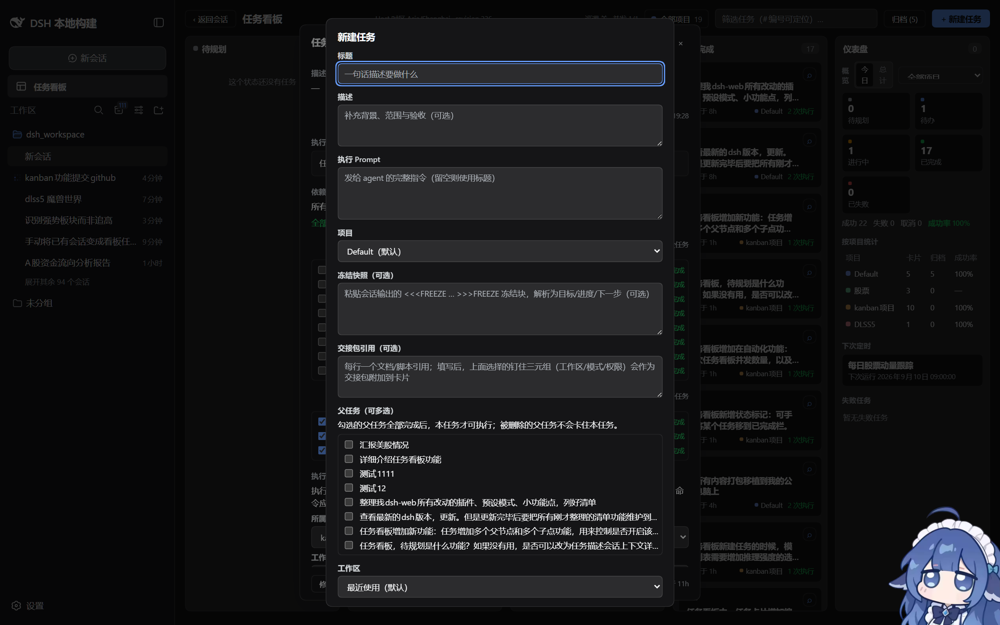
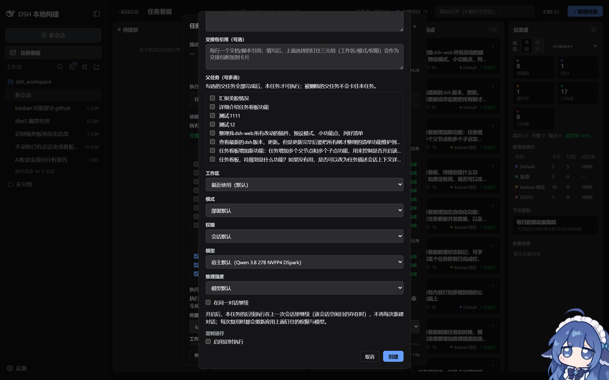
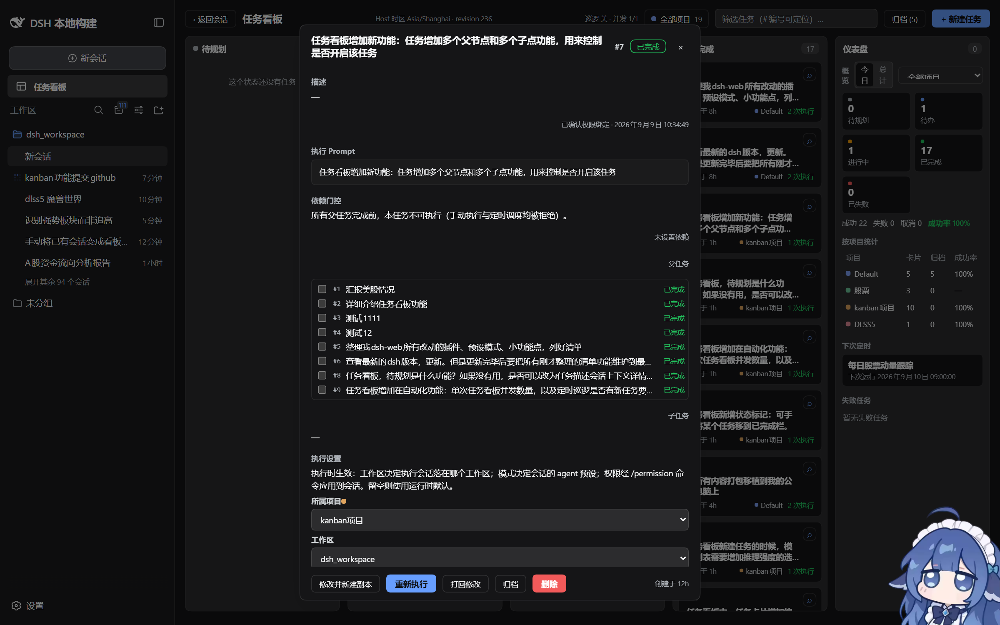
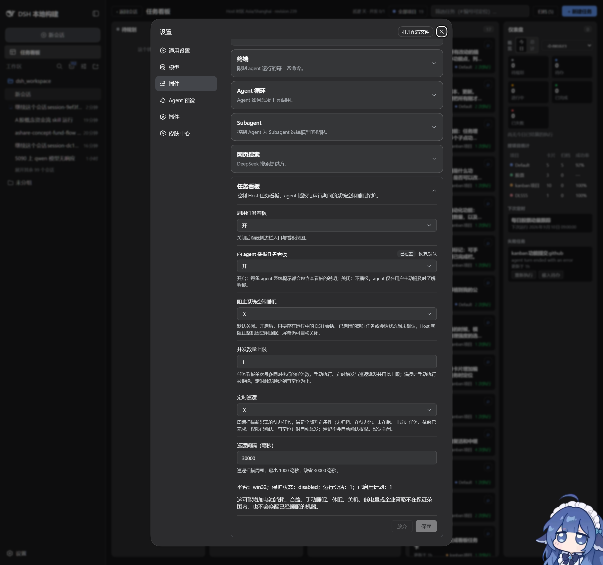
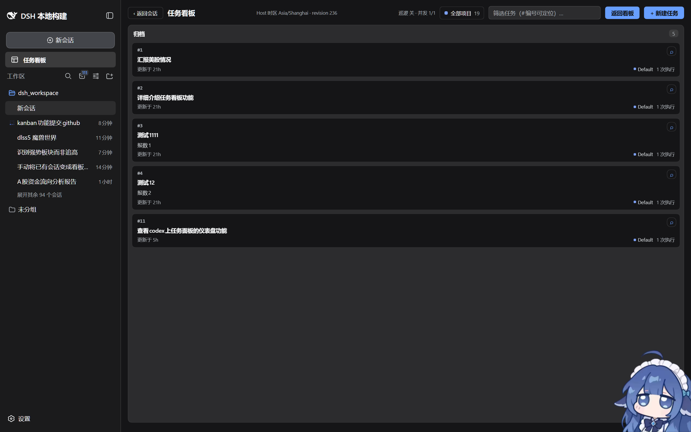

# dsh-task-board — DSH web GUI task board plugin

English | [中文](README.zh.md)

A hot-pluggable DeepSeek Harness (DSH) client GUI plugin: it adds a **task board** entry below "新会话" (New session) in the sidebar; clicking it switches the middle column entirely to a multi-column kanban view. Tasks execute for **real** through DSH's own session mechanism (`session.prompt`), and execution status is written back to the card in real time.

- No DSH source modification: mounted as a cordis plugin + browser DOM extension (add-on shape identical to `dsh-web-ui/packages/skins/skin-center`).
- Unmounting restores the original state; other managed segments (dsh-skin / skin-center / personal config) are unaffected.
- Task data persists locally: a page refresh or a DSH restart loses nothing.

- The board's source of truth is a **host-side ledger** (not the browser tab), so schedules, patrol dispatch and status write-back keep working after the browser is closed.

## Screenshots

**Multi-column board + live dashboard** — 待规划 / 待办 / 进行中 / 已完成 plus the dashboard panel in the 已失败 slot. Every card carries its global `#N` serial, project chip, schedule marker and run count; the header shows the patrol state and the open-run count against the concurrency cap.



**New task** — title, description and execution prompt, plus the schedule, dependency, project and execution-target (workspace / mode / permission) pins.



**New task, lower half** — schedule editor (daily / weekly / monthly / interval / custom, weekday chips and exact time), parent / child dependency multi-select, project picker and the workspace / mode / permission pins.



**Task detail** — content and prompt, execution log with real results and times, run / re-run, view session, delete with confirm, and manual column moves.



**Settings card** — the native DSH settings card for the board: enabled, announce to agent, idle-sleep protection, concurrency cap, patrol toggle and patrol interval, all applied live.



**Archive view** — done / failed cards can be archived off the board and restored at any time, keeping their execution history and session transcripts traceable.



## Features

- **Sidebar entry**: injects a "任务看板" (task board) entry row inside the sidebar column (`[data-pane="sidebar"]` on older shells, `[class*="sidebarCol"]` on the DSH 0.1.0-rc.6 AppFrame layout) below the new-session button (wide rail shows icon + text, collapsed rail shows a bare icon, adapting to DSH skin tokens).
- **Session row menu entry**: in the session list, each session row's ellipsis menu (the three-dot button) gets an **"add as task card"** item, shown **only while the session is not claimed by a non-archived task card** (`taskClaimedSessionIds`: the task's newest execution session, all its retained execution sessions, its freeze provenance session, and the source session the card was bound at creation — archived tasks release their sessions, so the item reappears for them). Clicking publishes a new-task request over the module-level bus (`new-task-request.ts`) and opens the new-task dialog with the **title pre-filled from the session title** (title only; description, prompt, and pins stay blank). The created card is **bound to its source session** (the task record persists `sourceSession`): the card and the detail show the source-session marker (a "Session"-prefixed chip in the card's meta row / a "Source session" section with a "View session" jump button in the detail); while that session is idle, a task execution **continues in that session** (ahead of the "reuse the previous run's session" rule; fail-closed to a fresh session when the roster is unknown or the session is busy); the source session joins the claimed set — the menu item disappears for it right after the card is created and reappears once the card is archived; the import gate does not carry the binding. The dialog renders in a **body-level standalone React root** (`session-new-task-overlay.tsx`) because clicking a sidebar row hands the middle column back to the conversation view, where an in-board copy of the dialog would be invisible. The injected row is plain DOM kept by the same self-healing MutationObserver pattern as the sidebar entry; session identity is read from the row's React fiber (the shell keeps the session id in React state, not DOM attributes), and a row whose fiber is unreadable is skipped rather than guessed. The observer resync is strictly no-op on a stable row — re-writing an unchanged label would record another mutation and feed its own callback (the row only touches the DOM when the label value actually changes).
- **Multi-column board**: four card columns — 待规划 (backlog) / 待办 (to do) / 进行中 (in progress) / 已完成 (done) — plus a **dashboard** panel in the 已失败 (failed) slot; cards show title, description, status, update time, and execution count; the top supports search filter, an archive view (done/failed tasks can be archived off the board and restored anytime, keeping execution history and session transcripts traceable), new task, and back to chat. 待规划 is a parking column: new tasks land in 待办 by default and can be parked there by drag/drop or the manual "move to 待规划/待办/已完成" action — it is the board's idle pool, not a description or context area.
- **Dashboard panel (the failed slot)**: the fifth grid slot is a live overview instead of a card column: per-status count tiles, a settled-execution tally (succeeded / failed / cancelled + success rate), up to 3 armed schedules with their next-run times, and a failed-task list (up to 5, most recent activity first, error snippet + relative time). The overview carries a **today/total dimension switcher** (default: today) — today slices the same board from the Host-local midnight (tiles count tasks created after the midnight, the tally counts runs settled after it; open runs stay out), total is the cumulative view, and the scheduled/failed sections below the overview are unaffected. Each failed row keeps one-click quick actions — 重新执行 (Run again, via the host re-run) and 移入待办 (Move to To Do) — and the whole row opens the task detail; the header pill shows the failed count. Failed tasks stay reachable everywhere else (detail, manual move, archive).
- **Card session button**: every card carries a magnifier button (top-right corner) that jumps straight to the task's newest execution session; before any run it jumps to the card's source session (the one it was created from, shown as the "Session"-prefixed chip in the card's meta row); with no session at all it falls back to opening the task details.
- **Task details**: click a card body to open details (title/description/execution prompt/execution log) — it does **not** execute on a single click; the details offer "执行 / 重新执行" (Run / Re-run), "删除" (Delete, with confirm), "查看会话" (View session, jumps to the execution transcript), and a manual move to 待规划/待办/已完成.
- **Real execution**: on "执行" (Run), the plugin connects a workspace session through the client runtime (`workspaces.connectWorkspace`, reusing a blank session or letting the host create one), names the session after the task title, and drives a real agent via `session.prompt([{ type: 'text', text }], 'queue')`; it then subscribes to that session's snapshot and, once the round really finishes, sets the card to 已完成/已失败 and records the execution result. The execution session appears in the session list and can be opened to view the real transcript.
- **Per-task execution targets**: a task can pin where and how it runs — **workspace** (the execution session lands in that workspace), **mode** (the agent preset the session is composed from, switched through `agentPresets.select` while the session is still blank), and **permission** (a sandbox preset applied through the `/permission <id>` slash command: read-only / workspace-write / danger-full-access). Blank pins fall back to the runtime defaults (recent workspace / deployment preset / session default). A pin that cannot be applied fails the run **before** the prompt is sent, so a task never silently runs under settings it did not ask for.
- **Status write-back**: card status (进行中 → 完成/失败) is driven by the real session state; after a page refresh/restart, leftover running tasks are auto-reconciled against the current session state (reconcile).
- **Scheduled tasks**: the new-task dialog and the details panel can schedule a task — an enable switch + a structured schedule editor modeled on popular reminder apps: a frequency tab row (daily / weekly / monthly / interval / custom), weekday chip picking with 工作日 / 周末 quick groups, an exact hour:minute picker, a day-of-month picker for monthly, and interval steppers with quick steps (5/10/15/30 minutes, 1/2/3/6/12 hours). Every structured choice serializes into the same 5-field cron expression (分 时 日 月 周, supporting `*` / `*/n` / `a-b` / comma lists); exotic expressions are typed verbatim in the custom tab (invalid intermediate states keep the last valid cron). Enabling computes and persists the "下次运行时间" (next run time), and the card shows a scheduled marker; at the due time it automatically takes the same real-execution path (as manual run), and the execution session remains linkable.
- **Dependency gating (multiple parents / multiple children)**: a task can declare any number of parent tasks (`parentIds`; its children are derived from the reverse dependency edge and are never stored on the child). A task is open only when **every existing parent has settled to 已完成 (done)** — otherwise the card carries a "waiting on N parents" badge and Run / Re-run stay disabled. The gate is host-enforced: a manual run/rerun is rejected with a `dependency-gate` error listing the pending parents, and a due scheduled occurrence is skipped and retried on the next tick until its parents settle (the stored next-run time does not roll forward while gated). Parents are set from the new-task dialog and the details panel (parent multi-select, plus the derived child multi-select that rewrites the reverse edges atomically); clearing with an empty set removes all edges. Deleting a parent task strips the dangling id from its children in the same transaction, so deleted parents never block (fail-open).
- **Project management (project grouping)**: cards can be grouped under **projects** managed from the toolbar — a project switcher chip (filter the board by one project or all) and a project manager (create / rename / recolor / delete, with an 8-color palette auto-assigned to new projects). A fixed **default project** (id `default`, renameable but undeletable) owns every card without an explicit project; deleting a project moves only its explicitly-owned cards into the default project — card serials (`#N`, a single global sequence) and execution history are never touched. Each card shows its owning project as a small chip; the new-task dialog picks the owning project (a duplicated card inherits its source's project), and the details panel carries a "belongs to project" select for reassigning. The dashboard adds a **per-project breakdown** (on-board cards / archived / settled-run success rate per project, "all projects" scope only; clicking a row drills the board into that project) and a project scope select next to the today/total switcher. Project grouping is a **presentation dimension only**: it never enters dispatch gating (patrol / concurrency / dependency checks), serial minting, or the execution path, and it persists in the Host ledger (schema v4) so projects keep working after the browser is closed.
- **Board automation (concurrency cap + scheduled patrol)**: a board-wide cap on how many tasks may execute at the same time (settings field `maxConcurrency`, default 1, live-adjustable). At the cap, a manual Run / Re-run is hard-rejected with a `concurrency-gate` error, and a due cron occurrence is **deferred** (its next-run time stays put, so it retries on the next scheduler tick instead of being dropped). The optional scheduled patrol (settings fields `patrolEnabled`, off by default, and `patrolIntervalMs`, default 30000) is a host-side timer that periodically scans the board for new eligible work and dispatches it into the free slots: a task is dispatched only when **every** gating condition holds — status 待办 (todo) (the 待规划 parking pool is never picked up), not archived, no open execution of its own, every existing parent settled to done, any elevated permission already confirmed by the user, and a free slot on the board. Cron-enabled tasks are owned by the cron scheduler and are excluded from patrol, and the patrol never auto-confirms permissions — an unconfirmed elevated-permission card is skipped, not launched. The board header shows a live chip with the patrol state and open-execution count against the cap. **Once a parent task settles (succeeded / failed / cancelled), the host immediately dispatches its newly eligible 待办 (todo) children (tasks WITH parents) into the free slots — settle-driven auto-continuation, always on and independent of the patrol toggle; a fresh independent todo is never auto-started by its own creation.** It is only a new trigger source and bypasses none of the gating conditions above; manually moving a parent to done, or confirming a permission, continues just as fast, and the first scheduler tick after a host restart catches up the downtime window.
- **Settings card**: the host half registers a `task-board` settings namespace, so DSH's own settings surface renders a native **task board card** with six live fields — `enabled` (master switch for the browser half and the host announcement, default on), `announceToAgent` (whether the `plugin:task-board` system-prompt section is injected, default off), `preventIdleSleep` (optional idle-system-sleep guard while sessions run or schedules are armed, default off — it does not block lid close, manual sleep, hibernate or shutdown), `maxConcurrency` (board-wide concurrent-run cap, integer ≥ 1, default 1), `patrolEnabled` (scheduled patrol, default off) and `patrolIntervalMs` (patrol scan interval, integer ≥ 1000 ms, default 30000). The card stages edits and writes them as **one atomic, revision-fenced mutation**; a settings edit takes effect **without restarting DSH** (the announcement section is re-registered when the value changes), and a rejected draft is surfaced with the host's reason instead of being silently dropped.
- **System-prompt injection**: the host half (`src/index.ts`) registers a `plugin:task-board` section (order 200) via `SystemPrompt.section`, declaring this plugin's existence, capabilities, and limits to every agent — it is injected while the plugin is in the composition **and** `announceToAgent` is on (default off; toggle it in the settings card, no restart needed) and disappears when the plugin is removed, so an agent needs no external docs to know how to work with this board.

## Directory structure

```
package.json / tsconfig.json / tsconfig.build.json / vitest.config.ts / tsdown.config.ts
build/tsdown.client.ts / build/web-platform.ts     # vendored dsh client-bundle preset + browser platform seed table
cordis.patch.yml                                   # bundle patch: inserts the ui-task-board row into the profile roster
scripts/dsh-task-board.js                          # one-click mount / unmount / status CLI
src/index.ts / src/invariant.ts                    # host half: config schema, SystemPrompt section, host wiring
src/host-service.ts                                # host scheduler tick (cron), patrol, settle-driven continuation, state stream
src/host-ledger.ts                                 # host-authoritative ledger (single-owner lock, atomic revision-fenced commits)
src/host-runner.ts                                 # real execution: connect a session, rename it, session.prompt, watch settlement
src/host-routes.ts / src/http.ts / src/loopback.ts # host HTTP surface + loopback guard
src/power-inhibitor.ts                             # optional idle-sleep protection (preventIdleSleep)
src/protocol.ts                                    # host <-> browser wire protocol (actions, snapshot, schema version)
src/dsh-home.ts / src/mount-once.ts / src/host/run-guarded.ts # host utilities (dsh home, single mount, guarded runs)
src/core/*.ts                                      # shared pure logic: tasks / schedule / store / dashboard / projects /
                                                   # executability / handover / rework / session-reuse / freeze-snapshot
src/core/use-cases/*.ts                            # pure ledger transitions (create / update / delete / archive / schedule / project)
src/client/index.ts                                # apply(ctx): runtime services, settings card, DOM mounts
src/client/board/*.tsx                             # React board views (columns / cards / detail / modals / dashboard / projects)
src/client/sidebar-entry.ts                        # sidebar entry injection (self-healing MutationObserver)
src/client/session-menu-entry.ts                   # session-row "add as task card" menu row (plain DOM, self-heal)
src/client/session-new-task-overlay.tsx            # body-level new-task modal root (independent of the board panel)
src/client/TaskBoardSettingsCard.tsx               # native settings card (six live fields)
src/client/locales.ts                              # zh / en UI dictionaries
src/client/board.module.css                        # styles (--dsw-* tokens, adapting to theme / skin)
tests/*.spec.ts                                    # 303 automated tests (ledger / state machine / cron / spec bridge / gating / automation / UI smoke)
docs/screenshots/*.png                             # the screenshots above
docs/project-management.md                         # project dimension design doc (v1 draft, implemented in 0.4.0)
```

## Why it is wired this way (research conclusions)

- **No usable add-on slot in the sidebar**: the sidebar shell only declares two single slots, `sidebar.workspaces` / `sidebar.settings`, both already taken by ui-workspace / ui-settings; an external plugin cannot register a new slot (declaring means claiming, and duplicating throws). So the entry goes through the skin-precedent **DOM injection**, self-healed with a MutationObserver (when a React re-render touches the node it re-inserts within the same frame, no flicker).
- **The middle column cannot be replaced through a slot**: the `conversation` slot is single and already taken by ui-conversation. The board view mounts on the center column (`[data-pane="conversation"]` on older shells, `[class*="centerCol"]` on the DSH 0.1.0-rc.6 AppFrame layout) as a tail child node (outside React's ownership), toggled via the `<html data-dsh-taskboard-active>` attribute, keeping the chat subtree below mounted and stateful.
- **The Host owns the ledger**: the board's source of truth is a host-side ledger (`~/.dsh/task-board/ledger-v2.json`, atomic tmp+rename+fsync commits, single-owner `ledger-v2.lock`), served over the plugin's own host routes; the browser reaches it through `HttpTaskBoardHostTransport`. Browser `localStorage` (`dsh.taskBoard.v1`, `LocalStorageTaskStore`) remains only as a **degraded fallback** when the host RPC is unavailable — the project UI is hidden on that path, so the board degrades gracefully instead of forking a second storage model.
- **Execution rides the client runtime**: `ctx.sessions.list` subscribes to session state (`running` / `byId`), `ctx.workspaces.connectWorkspace()` creates/reuses a session, `session.prompt()` drives a real agent, and `ctx.sessions.open()` jumps to the transcript.
- **Execution targets ride the same runtime faces**: the workspace pin passes the task's id to `workspaces.connectWorkspace()` (validated against the workspace list first, so a stale pin fails locally); the mode pin recomposes the blank execution session via `api.agentPresets.select` — only legal before the first turn, so it runs before `session.prompt`, and `sessions.noteAgentPreset` keeps the list label current; the permission pin admits a `/permission <id>` slash command through `session.command` — the same mechanism the shell's own permission picker uses. A rejected admission or a line no command claims fails the run before the prompt.
- **Background settlement relies on list reconciliation**: an unopened session has no chat-snapshot window (cold), so settlement keys off the session list — every list change reconciles running tasks; result judgment takes, in order, "missing from list → cancelled / still running → wait / chat snapshot visible → by lastAgentError / tail of raw history → a turn-error node proves failure / otherwise success", and reconciliation is idempotent.
- **Scheduling lives in the Host, not in a tab**: `src/host-service.ts` ticks every 30 s (`SCHEDULE_TICK_MS`); a due cron occurrence is rolled to its next match **before** it opens a run, so the same tick never double-fires, and occurrences missed during downtime are **skipped, not backfilled** (`skipMissed`). The GUI tab is no longer a scheduler — only the DSH host process has to be running, so closing the browser does not stop a schedule. The same tick reconciles open runs against real session state and dispatches settle-driven continuations.
- **One ledger, one owner**: the host ledger holds a single-owner lock, so exactly one DSH process owns the board at a time; every mutation is a revision-fenced atomic commit and the GUI follows the ledger revision (and its SSE stream), so multiple tabs can never diverge, resurrect a deleted task, or write back a stale copy.
- **Stable card serial**: the Host ledger mints each task a global, strictly-increasing `serial` (the next number is held in the ledger document) and shows it as `#N` on the card, the detail header, and dependency rows, so tasks can be cited by number when assigning work. Tasks persisted before numbering existed are backfilled in creation order on the next Host load; a number is never re-issued after its task is deleted. The board filter accepts `#N` (whitespace after the `#` tolerated) as an exact serial match.

## Install

Pick one of three paths:

```sh
### 1) From npm (published package)
dsh plugin --profile web add @linxin666/dsh-client-ui-task-board

### 2) From this repository's GitHub Release (prebuilt tarball, latest version)
curl -L -O https://github.com/ding7015869-alt/dsh-task-board/releases/latest/download/linxin666-dsh-client-ui-task-board-0.4.2.tgz
dsh plugin --profile web add file:$(pwd)/linxin666-dsh-client-ui-task-board-0.4.2.tgz

### 3) From source (development)
git clone https://github.com/ding7015869-alt/dsh-task-board.git
cd dsh-task-board
pnpm install && pnpm run build
dsh plugin --profile web add link:$(pwd)
```

The family aggregate package `@linxin666/dsh-web-ui-all` installs this plugin together with the rest of the DSH web GUI plugin family.

After installing, **restart `dsh web`** — a "任务看板" (task board) entry appears below "新会话" (New session) in the sidebar; a page refresh is not enough, the process must restart.

## Build

Prerequisites: Node ≥ 20 with the official NPM SDK reachable. Types and runtime APIs all come from the official NPM SDK (`@deepseek-ai/*` devDependencies), and the browser bundle preset is vendored in `build/` — **no DSH source checkout is required**.

```sh
cd dsh-task-board
pnpm install        # install dependencies in the repo root
pnpm run build      # tsc type emit + tsdown -> lib/index.js, lib/invariant.js, lib/client.js
pnpm run typecheck  # tsc --noEmit
pnpm test           # vitest: 303 tests (ledger / state machine / cron / spec bridge / gating / automation / UI smoke)
```

`pnpm run build` is required before `dsh plugin --profile web add link:$(pwd)`: the profile resolves the package through `lib/` (`main` / `exports`), and `lib/` is not committed.

## Mount / Unmount

This plugin uses the official profile-bundle shape (package.json declares `dsh.bundle.patch` + `dsh.client`, see `cordis.patch.yml`). Mounting = registering the dependency and bundle rows in the web profile manifest (`~/.dsh/profiles/web/package.json`) and installing:

```sh
# Mount (registers dependencies + dsh.profile.bundles, pnpm install; takes effect after restarting the GUI)
node scripts/dsh-task-board.js mount

# View status
node scripts/dsh-task-board.js status

# Unmount (removes the registered rows; restores the original GUI after restart; task data is kept)
node scripts/dsh-task-board.js unmount
```

The rows registered in the profile manifest:

```json
{
  "dependencies": { "@linxin666/dsh-client-ui-task-board": "link:/path/to/dsh-task-board" },
  "dsh": { "profile": { "bundles": [ "...", "@linxin666/dsh-client-ui-task-board" ] } }
}
```

> Note: the profile layer (bundle rows, `dsh.client` metadata) is read when the dsh web process starts, so a **restart of the dsh web GUI** is required after mount/unmount (a page refresh is not enough).

## Data storage location

- The task ledger is **host-authoritative**: `~/.dsh/task-board/ledger-v2.json` (`schemaVersion: 4`), written with atomic tmp+rename+fsync commits under a single-owner `ledger-v2.lock`; `scheduler-v2.json` holds the schedule bookkeeping.
- The ledger carries tasks, their executions, the global `nextSerial` counter, the scheduler state and the **projects** array (always including the fixed `default` project) plus each task's optional `projectId` (backfilled to `default` at load). Because projects and tasks share one file, one lock and one atomic commit, "delete project → move its cards" is a single transaction that can never leave an orphan card.
- Unmounting the plugin keeps the ledger; to clear it, delete `~/.dsh/task-board/` while `dsh web` is stopped.
- The browser keeps only `dsh.taskBoard.v1` in `localStorage` as the **fallback** used when host RPC is unavailable (`LocalStorageTaskStore` behind the `TaskStore` interface in `src/core/store.ts`); the fallback has no project layer, so the project UI is hidden there.

## Manual verification steps

1. `pnpm run build` → `node scripts/dsh-task-board.js mount` → **restart `dsh web`** → open `http://127.0.0.1:3080`.
2. A "任务看板" (task board) entry row appears below "新会话" in the sidebar; click it → the middle column switches to the board: four card columns plus the dashboard panel in the 已失败 (failed) slot.
3. "+ 新建任务" (New task) with title/description/Prompt → the card appears in 待办 (to do). The dialog also offers 工作区/模式/权限 (workspace / mode / permission) pins — leave them blank for runtime defaults.
4. Pin a workspace/mode/permission on a task (in the dialog or the task detail) → run it → the execution session appears under the pinned workspace, its list row shows the pinned preset, and the session's permission selector shows the pinned permission.
5. Click the card → details show content and Prompt; click "执行" (Run) → the card becomes 进行中 (in progress) (a session named after the task title appears in the session list); after the agent finishes the card lands in 已完成 (done) or 已失败 (failed), the detail execution log has a result and time, and "查看会话" (View session) jumps to the real transcript.
6. Dashboard panel: the 已失败 (failed) slot shows the dashboard instead of a card column — status count tiles, settled-execution tally + success rate, the next armed schedules, and the failed-task list; a failed row's "重新执行" (Run again) re-executes through the host and "移入待办" (Move to To Do) requeues the task; the row click opens the task detail.
7. Scheduled task: details → tick "定时运行" (Scheduled run) to enable; the schedule editor (frequency tabs 每天 / 每周 / 每月 / 间隔 / 自定义) lets you pick 间隔 and the "10" quick step (cron `*/10 * * * *`), or any weekday chips + exact time; a scheduled marker appears on the card; wait for the next whole 10-minute mark, watch the card automatically enter 进行中 (in progress) and eventually complete, with "上次触发" (last trigger) showing a time and a new execution-log row (the session is linkable).
8. Dependency gating: create task B and, in its "依赖" (Dependencies) section, tick task A as a parent → B's card shows the "等待 1 个父任务" (waiting on 1 parent) badge and Run/Re-run stay disabled; run A to 已完成 (done) → the badge disappears and B opens (A's detail "子任务" (children) list now contains B); delete A → B's dangling edge is stripped and B stays open (fail-open).
9. Project management: open the project switcher chip in the toolbar → "管理项目" (Manage projects) → create a project (auto-assigned palette color), rename the default project (its id stays `default`), and try to delete it (blocked: the default project cannot be deleted); create task C and pick the new project in the new-task dialog → the card shows the project chip; open the card detail and switch "所属项目" (Belongs to project) to another project; on the dashboard, pick "全部项目" (All projects) → the per-project table lists on-board cards / archived / success rate per project, and clicking a row drills the board into that project (the scope hint appears and the table hides); delete the project → its cards move into the default project, their `#N` serials unchanged; refresh → projects and assignments persist (Host ledger).
10. Session row menu: in the session list, open the "..." (ellipsis) menu of a session that is not referenced by any non-archived task card → an "add as task card" (添加为任务卡) item appears → click it → the new-task dialog opens with the title pre-filled from the session title; a session referenced by a live task card (its newest/retained execution session, freeze provenance session, or bound source session) shows no item; archive the claiming task → the item reappears for that session; the item label follows the GUI language on switch.
11. Source-session binding: a card created from the session-row menu shows a "Session"-prefixed chip in its meta row (tooltip "Source session") and a "Source session" section (with a "View session" jump button) in its detail; the card's magnifier button jumps to that source session while no execution session exists yet; while the source session is idle, an execution **continues in it** (ahead of the reuse-previous-run rule); creating the card immediately claims the source session (the menu item disappears for it).
12. Settings card: Settings → the task board card shows the six fields (`enabled`, `announceToAgent`, `preventIdleSleep`, `maxConcurrency`, `patrolEnabled`, `patrolIntervalMs`) with their effective values; edit `maxConcurrency` to 2 and save → the board header chip updates without a restart; set `announceToAgent` on → the `plugin:task-board` section appears in the next agent's system prompt (and disappears when turned off); type an invalid value (e.g. `0` for `maxConcurrency`) → the save is blocked with the field marked invalid, and a rejected write surfaces the host's reason instead of silently dropping the edit.
13. Refresh the page / restart DSH → tasks remain; unmount the plugin → the GUI restores to its original state.

## Acceptance checklist

- After mount, a "任务看板" (task board) entry appears in the sidebar; clicking toggles the board, and clicking a session item returns to the chat view
- Session row menu: an "add as task card" (添加为任务卡) item in the "..." menu of a session not claimed by a non-archived task card (its newest execution session, all retained execution sessions, its freeze provenance session, or its bound source session); clicking opens the body-level new-task dialog with the title pre-filled from the session; claimed sessions show no item and it reappears once the claiming task is archived
- Source-session binding: a card created from the session row persists `sourceSession` (Host ledger) and shows the source session on its "Session"-prefixed chip and its "Source session" section (with a "View session" jump button); the card's magnifier button falls back to the source session before the first run; while the source session is idle, execution continues in it (ahead of the reuse-previous-run rule; fail-closed to a fresh session when the roster is unknown or the session is busy); the source session joins the claimed set (the menu item disappears right after creation); the import gate does not carry the binding
- Dashboard panel in the 已失败 (failed) slot: status count tiles, settled-execution tally + success rate, up to 3 next scheduled runs, and a failed-task list (up to 5) with 重新执行 (Run again) / 移入待办 (Move to To Do) quick actions and row click opening the task detail
- New task (title + description/Prompt); tasks remain after refresh/restart (host-authoritative ledger `~/.dsh/task-board/ledger-v2.json`)
- Click a card to open details (content + execution log); the details have "执行" (Run) and "删除" (Delete) buttons
- Execution really starts a session (its transcript is visible in the session list); card status follows the real execution progress; the details can jump to the execution session
- Delete has a confirm step, and the local store is synced-removed after deletion
- Scheduled tasks: cron configuration via the schedule editor (frequency tabs / weekday chips / exact hour:minute / monthly day picker / interval steppers / custom cron) with validation, next-run time, auto real execution at the due time, status write-back, scheduled card marker, scheduling resumes after a restart (host-side scheduling — the browser can be closed; missed occurrences during downtime are skipped, not backfilled)
- Dependency gating: a task with unsettled parents shows the "waiting on N parents" badge with Run/Re-run disabled; the host rejects run/rerun (dependency-gate error names the pending parents) and skips due scheduled occurrences until every parent is done; deleting a parent task unblocks its children (dangling ids fail open); parent/child multi-select in the new-task dialog and the details panel
- Project management: cards group under projects managed from the toolbar (switcher + manager: create / rename / recolor / delete, 8-color palette, an undeletable default project that owns all unclassified cards); the new-task dialog picks the owning project (duplicated cards inherit theirs) and the details panel reassigns via "belongs to project"; the dashboard adds a per-project breakdown (on-board / archived / success rate, all-projects scope only, row click drills in) plus a project scope filter; deleting a project moves its cards to the default project without touching serials or execution history; grouping is presentation-only (never enters dispatch gating) and persists in the Host ledger (schema v4)
- Board automation: the concurrency cap (maxConcurrency setting, default 1) hard-rejects a manual run at the cap (concurrency-gate error) and defers due cron triggers without dropping them; the scheduled patrol (patrolEnabled, off by default, patrolIntervalMs) auto-dispatches new 待办 tasks into the free slots only when every gating condition holds (not archived, no open execution of its own, all parents done, elevated permissions already confirmed, a free slot); cron-owned tasks are excluded from patrol and the patrol never confirms permissions; the board header chip shows the patrol state and open-execution count against the cap. **When a parent settles, its newly eligible 待办 children are continued automatically (settle-driven, always on, independent of the patrol toggle; only tasks WITH parents — a fresh independent todo is never auto-started; manually done parents and permission confirmations continue just as fast, and the first tick after a host restart catches up the downtime window)**
- Per-task execution targets: workspace/mode/permission pins persist across refresh, drive the execution session, and an un-appliable pin (missing workspace, locked preset, unknown permission command) fails the run with the reason visible in the execution log
- Settings card: the native DSH settings card exposes the six live fields (`enabled`, `announceToAgent`, `preventIdleSleep`, `maxConcurrency`, `patrolEnabled`, `patrolIntervalMs`); edits are staged and written as one atomic revision-fenced mutation, take effect without restarting DSH, and an invalid or rejected draft blocks the save with the reason shown
- One-click mount/unmount; after unmount the GUI restores and other managed segments are unaffected
- README + automated tests covering storage read/write, state transitions, execution trigger, cron parsing, the scheduler, dependency gating (host gate + scheduled skip + fail-open delete), board automation (concurrency cap + patrol dispatch + settle-driven auto-continuation + the all-conditions gate), the session-row "add as task card" menu entry (claimed-session predicate + new-task prefill + self-heal without a mutation feedback loop), and the source-session binding (persistence + claim predicate + execution session selection rule + dialog wire gate + card/detail display)

## License

[BSD 3-Clause License](LICENSE).
